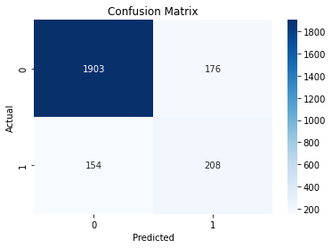
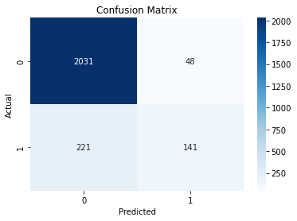
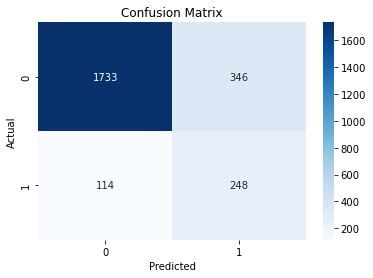

# Online Shoppers Purchasing Intention

### Team members:
    - Farah Alosaimi
    - Sultan Alharbi
    - Fahad Alotaibi
    
All team members partcibate in data preprocessing, data cleaning, EDA, creat charts, standardize and split the data, and finally apply the ML model

| Model                    | Members name |
| ------------------------|-----------------|
| Decision Tree and Random Forest    | Sultan Alharbi |
| Logistic Regression and Support Vector Machine     | Farah  Alosaimi |
| Naive Bayes and Gradient Boosting      | Fahad Alotaibi |

 ## Problem Definition
The main problem addressed in this study is to predict whether an online shopper is likely to make a purchase during a given session. By leveraging features such as the number of pages visited, duration spent on different page categories, bounce rates, exit rates, and page values, we aim to build a predictive model that can accurately determine a user's intention to purchase. This prediction can be invaluable for e-commerce businesses in tailoring their marketing strategies, improving website design, and providing personalized recommendations to potential customers.

## Goal
Develop a predictive model that accurately identifies online shoppers likely to make a purchase. This will enable businesses to allocate resources efficiently and customize marketing campaigns for high-intent visitors. Additionally, the study aims to gain insights into user behavior patterns, identifying factors that influence successful conversions or potential barriers to purchasing.

## Dataset overview
In this study consists of 12,330 sessions from different users over a one-year period. The sessions are carefully designed to avoid biases related to specific campaigns, special days, user profiles, or time periods. The dataset contains a variety of features, including the number of pages visited in different categories (administrative, informational, product-related), the duration spent on each page category, bounce rates, exit rates, page values, special day indicators, operating system, browser, region, traffic type, visitor type (returning or new), weekend visits, and month of the year.

This diverse set of features enables us to gain insights into the factors influencing online shoppers' purchase intentions. By analyzing user behavior and website performance metrics, we aim to develop a robust predictive model that accurately classifies sessions as leading to a purchase or not.

In our analysis, we will explore the dataset, preprocess the data, and engineer relevant features. We will then utilize machine learning algorithms to train and evaluate predictive models. By leveraging the power of data analysis, our goal is to provide valuable insights that can assist e-commerce businesses in effectively converting online visitors into satisfied customers.

## Results
​
We trained and tested the following 6 machine learning models on the dataset:
​
1. Decision Tree
2. Random Forest
3. Logistic Regression
4. Support Vector Machine
5. Naive Bayes
6. Gradient Boosting
​
The following table summarizes the accuracy of each model, along with a small graph showing the confusion matrix for each algorithm:
​
| Model                    | Confusion Matrix |
| ------------------------|-----------------|
| Decision Tree, Accuracy = 0.864     |  |
| Random Forest, Accuracy = 0.902     |  |
| Logistic Regression, Accuracy = 0.883     |  |
| Support Vector Machine, Accuracy =  0.890    |  |
| Naive Bayes, Accuracy = 0.811     |  |
| Gradient Boosting, Accuracy = 0.905     |  |
​
As we can see from the table, the Random Forest and Gradient Boosting models achieved the highest accuracy of ~ 0.90, followed by the Support Vector Machine model with an accuracy of 0.890. The Naive Bayes model had the lowest accuracy of 0.811.
​
So, after comparing between all applied model, the best model for our problem is "Gradient Boosting"

## Data source
[Online Shoppers Purchasing Intention Dataset](https://archive.ics.uci.edu/dataset/468/online+shoppers+purchasing+intention+dataset)   