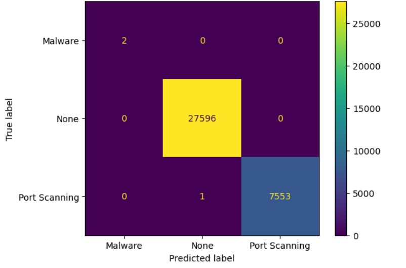
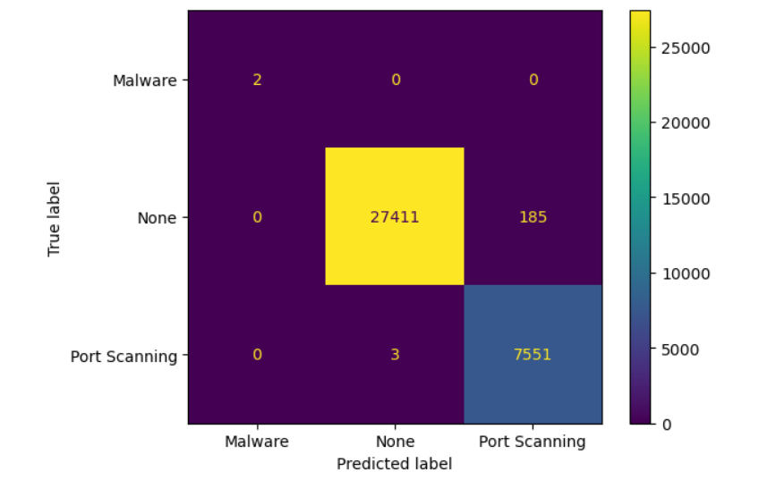

# Tuwaiq Data Science Bootcamp

## Project 4

## Team members and their roles :

- Norah Almuhaisen
- Lama Alshabani
- Essa Alhamad

## Introduction :

This project is focused on developing a machine learning model to detect cyber attacks using network flow data. The network data schema is in the Netflow V9 format, and the dataset is divided into two files: 'train_net.csv' and 'test_net.csv'.

The 'train_net.csv' file contains labeled data that explains when a particular ALERT will happen. The dataset includes 4 classes of cyber attacks:

'None'
'Port Scanning'
'Denial of Service'
'Malware'
The objective of this project is to build a classifier that can accurately predict the class of a network flow based on its features. The trained model can be used to identify and prevent cyber attacks, which is critical for maintaining the security of computer networks.

In the following sections of this Read.ME file, we will explore the dataset, preprocess the data, and build a machine learning model to classify the network flows into their respective classes. Finally, we will evaluate the performance of the model and discuss potential improvements
    

## Dataset Overview :

FLOW_ID | PROTOCOL_MAP | L4_SRC_PORT | IPV4_SRC_ADDR | L4_DST_PORT | IPV4_DST_ADDR | FIRST_SWITCHED | FLOW_DURATION_MILLISECONDS | LAST_SWITCHED | PROTOCOL
--------|--------------|-------------|---------------|-------------|----------------|----------------|----------------------------|---------------|----------
370548101 | udp | 50927 | 10.114.226.5 | 53 | 204.61.216.100 | 1647716065 | 1 | 1647716065 | 17
367147345 | icmp | 0 | 34.208.29.22 | 0 | 10.114.224.244 | 1647676228 | 10540 | 1647676239 | 1
369996289 | icmp | 0 | 34.219.129.172 | 0 | 10.114.224.218 | 1647702042 | 0 | 1647702042 | 1
374311525 | tcp | 49738 | 10.114.225.201 | 443 | 185.33.221.15 | 1647780914 | 10472 | 1647780925 | 6

## Results of ML models :
Since we need to classify network connections, we used Algorithm Classification, so we tried KNeighbour, GaussianNB, RandomForest, Support Vector Machine, and DecisionTree. We found the highest accuracy percentage in the algorithms, that is  DecisionTree , GaussianNB, Random Forests, ..Respectively

### DecisionTree 

### GaussianNB

### RandomForest

# Dashboard.

